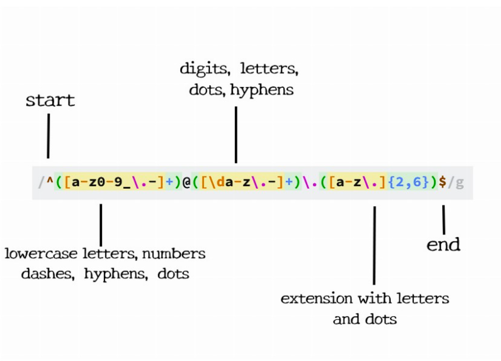

# CS-regex

Regular expressions are a powerful tool to match text. They are used in many programming languages and are also used in many text editors. This tutorial will help you learn the basics of regular expressions.

## Summary

This tutorial is going to help understand the email regular expression, /^([a-z0-9_\.-]+)@([\da-z\.-]+)\.([a-z\.]{2,6})$/ . I will break it down into its components and explain what each of them do.

## Table of Contents

- [Anchors](#anchors)
- [Quantifiers](#quantifiers)
- [OR Operator](#or-operator)
- [Character Classes](#character-classes)
- [Flags](#flags)
- [Grouping and Capturing](#grouping-and-capturing)
- [Bracket Expressions](#bracket-expressions)
- [Greedy and Lazy Match](#greedy-and-lazy-match)
- [Boundaries](#boundaries)
- [Back-references](#back-references)
- [Look-ahead and Look-behind](#look-ahead-and-look-behind)

## Regex Components

A regax component is a part of a regular expression that is used to match a specific pattern by using a specific character and combination of characters.

### Anchors

Anchors are used to match a specific character or group of characters at the beginning or the end of a string by using a caret (^) or an exclamation mark (!).

### Quantifiers

Quantifiers are used to specify the number of times a character or group of characters should be matched by using a number or a range of numbers.

### OR Operator

The OR operator is used to match one of two or more patterns by using a vertical bar (|).

### Character Classes

Character classes are used to match a single character from a set of characters by using a set of characters enclosed in square brackets ([ ]).

### Flags

Flags are used to modify the behavior of a regular expression by using a pound sign (#).

### Grouping and Capturing

Grouping is used to group a set of characters or groups of characters together by using a round bracket ( ( ) ).

### Bracket Expressions

Bracket expressions are used to match a single character from a set of characters by using a set of characters enclosed in square brackets ([ ]).

### Greedy and Lazy Match

Greedy and lazy match are used to specify whether a regular expression should try to match as much text as possible by using a question mark (?) or an asterisk (*).

### Boundaries

Boundaries are used to match the beginning or the end of a string by using a dollar sign ($) or a caret (^).

### Back-references

Back-references are used to match a previously matched group by using a backslash (\) and a number.

### Look-ahead and Look-behind

Look-ahead and look-behind are used to match a specific pattern only if it is followed or preceded by another pattern by using a question mark (?) or an asterisk (*) and a round bracket ( ( ) ).

## Author

This tutorial was created by [Victor Romero-Beltran]((https://github.com/vromero-beltran)).